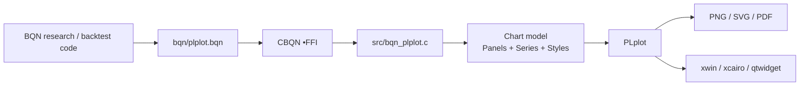
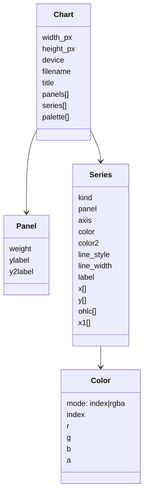
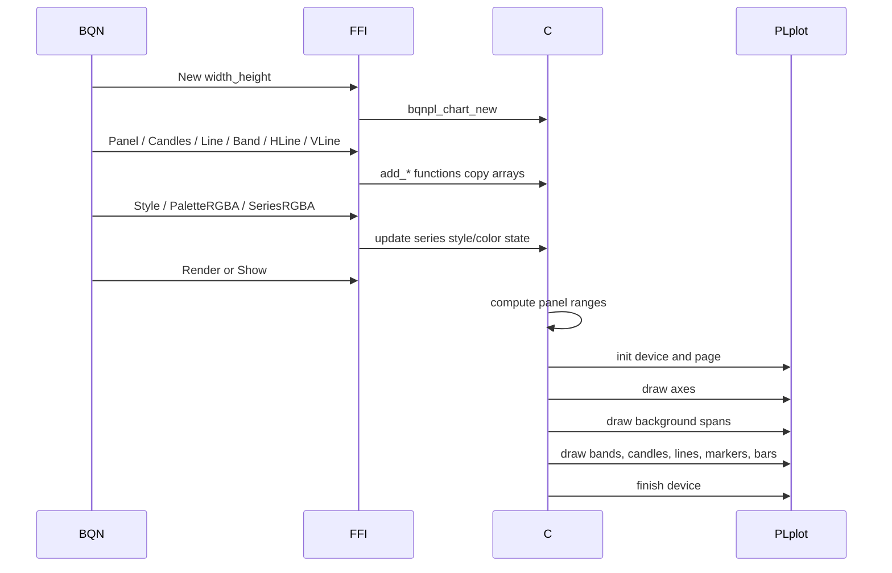
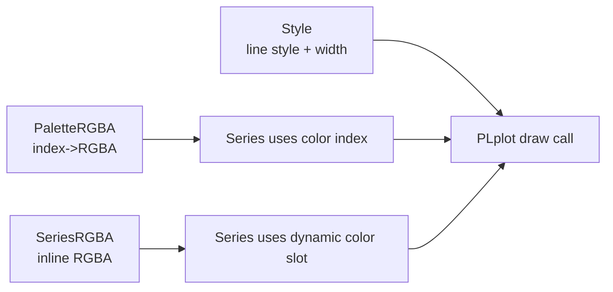
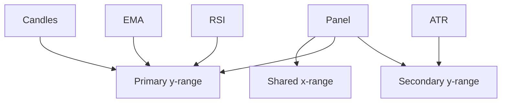

# Architecture

The bridge is intentionally layered. BQN should describe the chart and pass numeric arrays. The C layer owns PLplot handles and rendering details.



## Responsibilities

### BQN layer

- Computes OHLCV arrays and indicators.
- Creates panels and series.
- Applies semantic styling: support, resistance, regime spans, entries/exits, cloud fills.
- Chooses output device or popup device.

### C bridge layer

- Validates panel/series ids.
- Copies arrays received through FFI.
- Stores chart model until render/show.
- Computes panel x/y ranges.
- Applies color, alpha, line style, and line width.
- Calls PLplot primitives.

### PLplot layer

- Handles raster/vector/interactive output.
- Draws lines, filled polygons, markers, bars, boxes, labels, and axes.

## Chart model



## Render flow



## Data ownership

BQN arrays are passed through FFI as pointers only for the duration of the FFI call. The bridge copies all arrays immediately into `PLFLT` buffers. This avoids dangling references and keeps rendering safe after the BQN expression that produced the data has completed.

```mermaid
flowchart TD
    A[BQN numeric array] -->|FFI pointer during call| B[C add_* function]
    B -->|copy to PLFLT[]| C[Series-owned storage]
    A -. not retained .-> D[No raw BQN pointer stored]
    C --> E[Render later]
```

## Styling model

A series has:

- primary color
- secondary color, used by candles/OHLC down bars
- line style
- line width

Colors can be either palette-index colors or explicit RGBA colors.



## Axis model

Each panel has a primary y-axis and an optional secondary y-axis. Series attached to primary and secondary axes contribute to separate y-ranges. The x-range is shared within a panel.



## Layer ordering

Within each panel:

1. axes and labels
2. background spans
3. all other primary-axis layers in insertion order
4. secondary-axis axis and label if used
5. all secondary-axis layers in insertion order

This means spans should be added before or after other layers without changing their background behavior; they are always drawn first.
